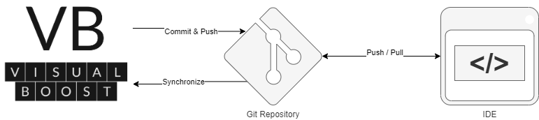

# VisualBoost - Develop fast! Keep flexible!


<br>
<p align="center">
  
</p>

Unlock your software development potential effortlessly with VisualBoost! Our web-based application assists developers in implementing both backend and frontend applications, freeing them to focus on business logic while automating redundant tasks.
VisualBoost empowers you to design comprehensive software architectures and seamlessly transform them into fully functional backend applications with corresponding client code. 
The resulting product is entirely yours to own. Furthermore, VisualBoost allows customization of the generated code, with any adjustments seamlessly integrated back into the overarching concept. 
Accelerate your development process and amplify productivity with VisualBoost!

### Prerequisites

- Docker: ``v20.10.21 or higher``
- Docker-Compose: ``v2.21.0 or higher``

# How to start

---

### Step 1 - Access the repository

#### Option 1 - Pull the repository
Pull or download the ``https://github.com/visualboost/VisualBoost.git``

#### Option 2 - Download code via curl
````shell
curl -L -H  "Accept: application/vnd.github+json" https://github.com/visualboost/VisualBoost/archive/refs/heads/main.zip -o visualboost.zip && unzip visualboost.zip
````

### Step 2 - Configuration
Adapt the configuration variables in [.env](./app/.env) that are marked with `***Please adapt***`. 
For further information please check the [Configuration](#configuration) section below.

### Step 3 - Start the application

> :warning: **Running VisualBoost on Windows:** <br/><br/>Ensure that the line separators for the files are set to LF (Unix and macOS):<br/>
> [init_replicaset.sh (auth)](./services/auth/database/init/init_replicaset.sh),<br/>
> [init_user.sh (build)](./services/build/database/init/init_user.sh), <br/>
> [init_replicaset.sh (main)](./services/main/database/init/init_replicaset.sh) 
> <br/><br/>**The conversion may vary depending on your development environment**.

<br/>
Run VisualBoost:

````shell
docker-compose -f ./app/docker-compose.yml up
````

Run VisualBoost in background:

````shell
docker-compose -f ./app/docker-compose.yml up -d
````

### Step 4 - Use VisualBoost
Open VisualBoost by entering the URL in your browser.
To get a closer look at how VisualBoost works, you can watch this [video](https://www.youtube.com/playlist?list=PL_KLQBBjBxQaxzPsSb6UckLbwmTkG27Fm).

<h1 id="configuration">Configuration</h1>

| Variable Name       | Description                                                                                                                                                                                                                                                                                                         |
|---------------------|---------------------------------------------------------------------------------------------------------------------------------------------------------------------------------------------------------------------------------------------------------------------------------------------------------------------|
| `MONGO_ADMIN_PW`    | The admin password for the databases. Don't lose it.                                                                                                                                                                                                                                                                |
| `MONGO_USER_PW`     | The user password for the databases. Don't lose it.                                                                                                                                                                                                                                                                 |
| `DOMAIN`            | The domain used to access VisualBoost.<br/>**Example:** http://localhost or https://app.visualboost.de.                                                                                                                                                                                                             |
| `PROXY_PORT`        | The port used to access VisualBoost.<br/>Should be either `80 (localhost)` or `443 (public domain)`.                                                                                                                                                                                                                |
| `JWT_SECRET`        | A secret key for creating JSON Web Tokens.                                                                                                                                                                                                                                                                          |
| `INTERNAL_KEY`      | A secret key used for communication between services.                                                                                                                                                                                                                                                               |
| `ENCRYPTION_KEY`    | A secret key used to encrypt sensitive data.                                                                                                                                                                                                                                                                        |
| `BASIC_AUTH_USERS`  | Can be used to restrict access to VisualBoost.<br/>**Example:** `username_1:hashed_password`.<br/>You can use https://bcrypt-generator.com/ to hash your passwords. Don't forget to remove the necessary comment signs `#` inside the [docker-compose.yml](./app/docker-compose.yml) if you want to use basic auth. |
| `MAIL_HOST`         | Your mail provider used for authentication.                                                                                                                                                                                                                                                                         |
| `MAIL_PORT`         | The port of your mail provider used for authentication.                                                                                                                                                                                                                                                             |
| `MAIL_USER`         | The email address used to send verification emails.                                                                                                                                                                                                                                                                 |
| `MAIL_PW`           | The password of the email account.                                                                                                                                                                                                                                                                                  |
| `LETS_ENCRYPT_MAIL` | An email address used to create a Let's Encrypt SSL certificate.<br/>Don't forget to remove the necessary comment signs `#` inside the [docker-compose.yml](./app/docker-compose.yml) (Keyword: sslresolver) if you want to access VisualBoost via https.                                                           |
| `SSL_ENABLED`       | Set to true if you want to access VisualBoost via `https`.                                                                                                                                                                                                                                                          |
| `WATCHTOWER_TOKEN`  | The password used to update VisualBoost.                                                                                                                                                                                                                                                                            |